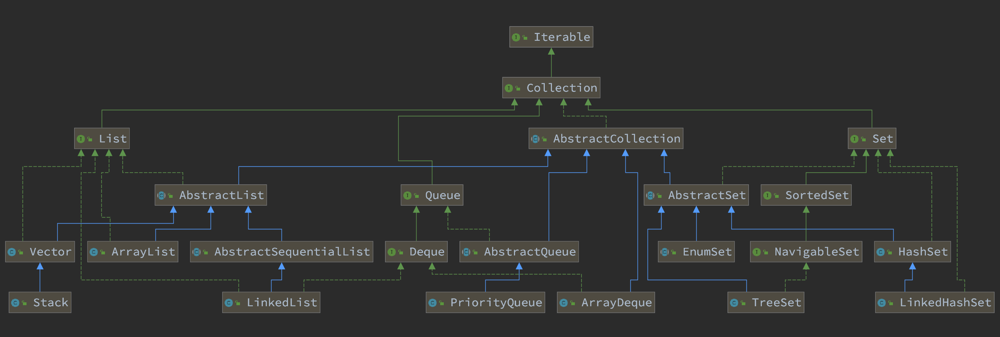

# 集合

集合分为两个部分，一个是list，另一个是map

## list部分：

分为Iterator、list、Queue、Set
- Iterator：
  - java.lang.Iterable
  - java.util.Iterator
  - java.util.PrimitiveIterator
  - java.util.ListIterator 
  - java.util.Spliterator
  - java.util.Enumeration 
  - java.util.Collection 
  - java.util.AbstractCollection
  
- list 
  - java.util.List 
  - java.util.AbstractList 
  - java.util.AbstractSequentialList 
  - java.util.LinkedList
  - java.util.Vector
  - java.util.Stack
  - java.util.ArrayList

- Queue 
  - java.util.Queue 
  - java.util.Deque
  - java.util.AbstractQueue
  - java.util.ArrayDeque
  - java.util.PriorityQueue
  

集合遍历的过程需要通过迭代器遍历，Iterable是list集合的父类  

## Map部分

- java.util.Map
- java.util.SortedMap
- java.util.NavigableMap
- java.util.AbstractMap
- java.util.TreeMap
- java.util.WeakHashMap
- java.util.EnumMap
- java.util.IdentityHashMap
- java.util.LinkedHashMap
- java.util.HashMap
- java.util.Dictionary
- java.util.Hashtable

整体图

