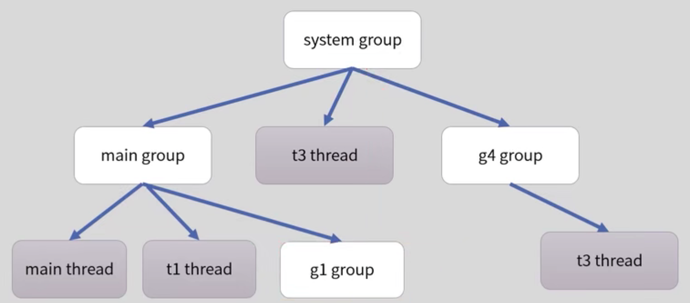

# 线程组

存在线程安全的问题，一般的不要使用。

存在线程安全的问题，一般的不要使用。

存在线程安全的问题，一般的不要使用。

它是为了方便管理而提出的方便线程管理，可以设置一组线程的属性，比如是否是守护线程、未处理异常的处理方法，安全策略等。也可以通过线程组得到一些线程的信息。




## 启动线程的方式

启动线程的方式有一种：

```java
new Thread().start();
```

Runnable只是执行逻辑

Callable也是执行逻辑，只不过进行了一系列的封装。


### 创建线程的方式

 三种创建方式

- Thread
- Runnable
- Callable

#### Thread

```java
public static void main(String[] args) {
    new Thread(){
        @Override
        public void run() {
            super.run();
            System.out.println("创建方式一");
        }
    }.start();
}
```

#### Runnable

```java
 public static void main(String[] args) {
     Thread thread = new Thread(new Runnable() {
         @Override
         public void run() {

         }
     });
     thread.start();
 }
```

#### callable

```java
class CallTask implements Callable<String> {
    @Override
    public String call() throws Exception {
        return "callable";
    }
} 
public static void main(String[] args) {
    CallTask task = new CallTask();
    //对象不能直接作为thread逻辑
    FutureTask<String> futureTask = new FutureTask(task);
    new Thread(futureTask).start();
    try{
        System.out.println("进入");
        String result = futureTask.get();
        System.out.println(result);
    }catch (ExecutionException | InterruptedException e){
        e.printStackTrace();
    }
}
```


### 为什么不使用stop来终止线程

stop会强制的终止了线程，会破坏原子性

案例

```java
     Thread thread = new Thread(new Runnable() {

            private int i;
            private int j;

            @Override
            public void run() {
                synchronized (this){
                    i++;
                    try {
                        Thread.sleep(1000);
                    } catch (InterruptedException e) {
                        e.printStackTrace();
                    }
                    j++;
                }
            }
        });
        thread.start();
        thread.stop();
    }
```

### interrupt

并不会真的中断线程，而是打上一个标记，并且不属于线程状态那个里面的几种状态。


### 线程的6个状态

new  running  waiting  timeWaiting terminated  black

