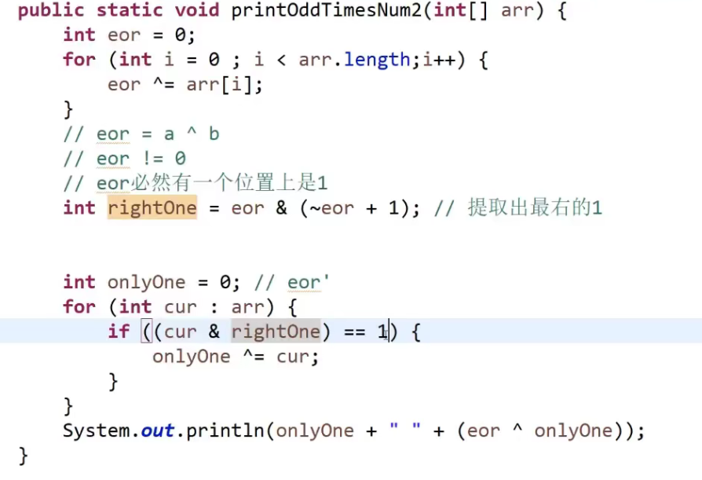

# 数据结构

> 研究非数值计算的程序设计问题的操作对象（一定关系组织的集合），
>
> 研究组织数据方式的学科，通过它可以编出更加有效率，并且漂亮的的代码。


## 数据结构的分类

逻辑结构/物理结构（存储）

逻辑结构：

- 集合结构
- 线性结构
- 树形结构
- 图形结构

物理结构：

- 链式结构
- 顺序结构

## 算法

一定的条件，对数据进行计算，得到需要的结果。

## 算法初体验

最好的算法：占用的内存小，计算速度快。

## 算法分析

时间分析：时间复杂度
空间分析；空间复杂度

分析方法：

- 事后分析法：代码写好之后，通过打印时间差来计算时间。
- 事前分析法：算法的策略和方案，编译产生的代码质量。

事前分析受那些因素影响：

- 采用的策略和方案
- 编译产生的代码质量（不可控制）
- 输入规模
- 机器执行的指令速度（不可控制）

所以开始之前需要知道问题的规模和实施方案。

```java
for(int i=0;i<10;i++){
    //for 循环执行的次数是11次，for循环里面的是10次，一般忽略了for循环的次数，只需要考虑里面代码的次数就可以了。
}
```

- 为什么不需要for语句的次数？

为了计算更有条理，更加方便，所以需要忽略掉他们。并且我们真正关心的只有for里面的语句，一般只关心核心代码。

**总结：**

算法分析最重要的是把核心操作次数和输入规模关联起来。


## 时间复杂度

是固定时间的叫做常树操作，比如+-x/,计算时间复杂度只取次数最高项，不要系数，判断好坏需要先判断时间复杂度，在判断实际运行的时间，”常熟项时间“

就是使用理论值比较，如果无法得到结果，就使用实际跑程序

## 额外空间

需要多少的额外空间。有限的几个变量就可以，那么就是o(1)


## 异或怎么理解

无进位的相加

0和任何数字进行异或都是任何数字    

任何数字 异或  任何数字     

交换律：a^b^c  a^c^b  

so一大堆的数，进行异或的顺序无关 

```jav
a,b
a = a ^ b;
b = a ^ b;
a = a ^ b;
```

位置不可以相同   位置相同的时候就会将数据抹掉。


一个数奇数次。，将所有的都进行一次异或操作

偶数次，先进行一次异或，得到不同值a^b，得到它们不相同的

在进行一次异或，数据分为两部分，a or b


a & (~a + 1)提取最右侧的1



# 稳定性

就是排完序之后，尽量保持原理的顺序，对于基本数据类型不会有太大的影响

选择排序不可以保证稳定

冒泡排序是稳定的

插入排序也是

归并排序  

快排不可以

堆不可以

想一下为什么不稳定和稳定


## Hash

hash表在使用的时候都认为是常数级别  数据量是无关的


有序表


