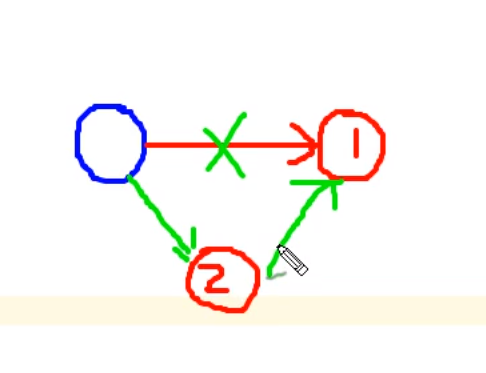

# 数据结构

数据结构分为线性的和非线性的。

## 线性表

线性表是最基本的.简单的，也是最常用的数据结构，一个线性表就是具有相同特性数据元素的有限序列。

前驱元素：

​		若A元素在B元素前面，那么A就是B的前驱。

后继元素：

​		若A元素在B元素前面，那么B就是A的后继。

**特性表的特性:**数据元素之间具有一对一的逻辑关系。

1.第一个没有前驱，最后一个没有后继。

2.其他元素仅有一个前驱和一个后继。

### 分类

根据存储方式的分类：线性和链式的

### 常见的线性表

数组/队列/链表/栈

### 常见的非线性表

二维数组,多维数组，广义表，树结构，图结构。

##  顺序表

顺序表是使用数组的保存方式，使用一段连续的数据单元，一次存入数据，是的逻辑上将数据存储在各个数据单元中的。

### 顺序表的实现

Api设计

|  类名 |  SequenceList|
| ---- | ---- |
|  构造函数    | SequenceList(int capacity) |
| 成员方法 | clear()//清空线性表<br/>isEmpty()//是否为空，是就返回true否则就返回null<br/>length()<br/>insert(int i,T t)<br/>insert(T t)<br/>remove(int i)<br/>indexof(T t) |
| 成员变量 | private T[] eles:存储元素的数组<br/>private int N:当前线程表的长度 |

## 栈



push就是将数据放入到栈的里面，假设之前只存入了一个1，然后在次需要将数据压入栈中，就需要将数据2放到1的前面。


## 括号匹配

创建一个栈用来存储左括号，然后继续遍历字符串，如果是一个左括号，那么将数据放入到栈中，如果是右括号，那莫就从左括号栈中弹出一个左括号，如果有那么就继续，如果没有直接返回false.然后继续遍历。最后字符串到达末尾，如果左边剩余了左括号那么就将说明不匹配。

### 求表达式的值

1.创建一个栈，用来存储数据。

2.遍历数组（表达式）

3.判断当前值是操作符还是数据

- 数据就存入栈中
- 操作符，就弹出数据，进行计算，将结构写进栈中。

4.弹出最终结果。


# 稀疏数组和队列

## 稀疏数组

### 需求

> 一个五子棋，棋子的位置存储，只存储棋子的位置。

### 使用场景

当存储的数组中大多数地方为同一个值的时候。

### 处理方法

- 记录数组一共几行几列，共有多少个点
- 具有不同值的元素的行列及值记录在一个小规模的数组中，从而缩小程序的规模。

## 举例

word drop游戏将数组块的位置存储，使用稀疏数组，实现步骤：

- 记录数组的大小（长宽）
- 下面的每一行记录坐标记录值。


# 稀疏数组和队列

## 稀疏数组（sparseArray）

### 实际案例

word drop游戏，使用二维数组来保存单词块，但是单词并不会占用到所有的位置，很多地方都是0，其他部分是单词字母，有意义的也就哪个几个字母。所以使用稀疏数组来保存游戏进度。

### 使用场景

当数组中大部分存储相同的元素，只有少部分存储的数据不同，就可以考虑使用稀疏数组。

### 稀疏数组的处理方式

- 一般的会有好几列数据，二位数组一般是3列，也可以理解为N行，3列的数组。
- 存储说明
  - 第一行存储数组的大小，最后一个是数据的个数
  - 其余的存储数据，某行，某列，某值

### 实现 思路

- 变量所有的数据，统计出需要存储数据的个数
- 创建数组aparseArr'['sum+1']\'\'[\'3]\',sum+1是因为第一行我们存储特定 的数据。

### 实现

```java
package com.test.hanshunping;

public class SparseArray<T extends Comparable> {
    //将数组转换为稀疏数组（如果是存储，那么就直接存储，不需要转换。）
    public void ArrayToSparseArray(int[][] arr) {
//        //遍历数组，找出共需要存储的个数sum
//        int sum = 0;
//        for (int i = 0; i < arr.length; i++) {
//            for (int j = 0; j < arr[0].length; j++) {
//                if (arr[i][j]!=0){
//                    sum ++ ;
//                }
//            }
//        }
//        //创建数组，用来存储数据，数组的大小为temp[sum+1][3]
//        int temp[][] = new int[sum+1][3];
//        int tempi = 0;
//        temp[0][0] = arr.length;
//        temp[0][1] = arr[0].length;
//        temp[0][2] = sum;
//        //遍历数组，将数据存入temp数组
//        for (int i = 0; i < arr.length; i++) {
//            ++tempi;
//            for (int j = 0; j < arr[0].length; j++) {
//                if (arr[i][j]!=0){
//                    temp[tempi][0] = i;
//        		      temp[tempi][1] = j;
//				      temp[tempi][2] = arr[i][j];       
//                }
//            }
//        }
        int num = totalChar(arr, 0);
        //创建数组
        int sparseArr[][] = new int[num + 1][3];
        sparseArr[0][0] = arr.length;
        sparseArr[0][1] = arr[0].length;
        sparseArr[0][2] = num;
        int iIndex = 0;
        for (int i = 0; i < arr.length; i++) {
            for (int j = 0; j < arr[0].length; j++) {
                if (arr[i][j] != 0) {
                    iIndex++;
                    sparseArr[iIndex][0] = i;
                    sparseArr[iIndex][1] = j;
                    sparseArr[iIndex][2] = arr[i][j];

                }
            }
        }
    }

    public int totalChar(int arr[][], int t) {
        int num = 0;
        for (int i = 0; i < arr.length; i++) {
            for (int j = 0; j < arr[0].length; j++) {
                if (arr[i][j] == t) {
                    num++;
                }
            }
        }
        return num;
    }

    public void huifu(int arr[][]) {
        int arrTemp[][] = new int[arr[0][0]][arr[0][1]];
        for (int i = 1; i < arr.length; i++) {
            arrTemp[arr[1][0]][arr[1][1]] = arr[1][2];
        }
    }
}

```

## 队列

### 应用场景

公司排队吃饭，先去的先拿到饭

### 队列的实现方式

- 链表
- 数组


