# 图

> 引入：
>
> - 线性表和树
> - 线性表局限于一个前驱和以后后驱
> - 树也只有一个前驱（父节点）
> - 那么多对多表示就使用图

## 图举例

图是数据结构，包含了0到多给相邻节点，连线叫做边，还有顶点。

### 图的概念

*名词：*

- 顶点
- 边
- 路径
- 无向图（没有方向的）
- 有向图
- 带权图

### 图的表示

那么我们如何表示呢？

- 二维数组(矩阵)
- 链表（邻接表）

#### 临接矩阵

临界矩阵是表示图形中顶点之间相邻关系的矩阵，没个顶点都表示1到n个点。相邻的为1，不相邻的为0.会存在空间浪费的情况。

#### 邻接表

临界表就不会

邻接表的是实现：

```java

public class LinJieBiao {
    private LinkedBlockingQueue queue[];
    private int verTexNum;
    private int lineNum;

    private LinJieBiao(int num) {
        this.verTexNum = num;
        queue = new LinkedBlockingQueue[num];
        for (int i = 0; i < num; i++) {
            queue[i] = new LinkedBlockingQueue(10);
        }
    }

    public void add(int v,int w){
        queue[v].add(w);
        queue[w].add(v);
    }

    public static void main(String[] args) {
        LinJieBiao biao = new LinJieBiao(10);
        LinkedBlockingQueue[] queue = biao.queue;
        biao.add(1,2);
        biao.add(1,3);
        biao.add(1,4);
        biao.add(1,5);
        biao.add(1,7);
        biao.add(1,6);
        biao.print(biao);


    }

    public void print(LinJieBiao biao){
        LinkedBlockingQueue[] queue = biao.queue;
        for (int i = 0; i < queue.length; i++) {
            LinkedBlockingQueue linkedBlockingQueue = queue[i];
            for (int i1 = 0; i1 < linkedBlockingQueue.size(); i1++) {
                System.out.println(linkedBlockingQueue.poll());
            }
        }
    }

}
```


####  图入门

1.存储

- 二维数组
- 相邻的就写1，其他的写0

2.思路


## 加权无向图

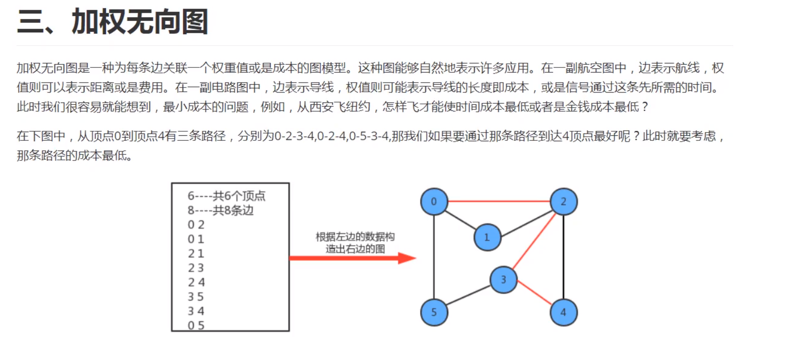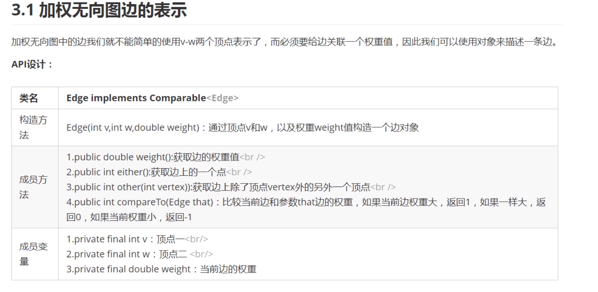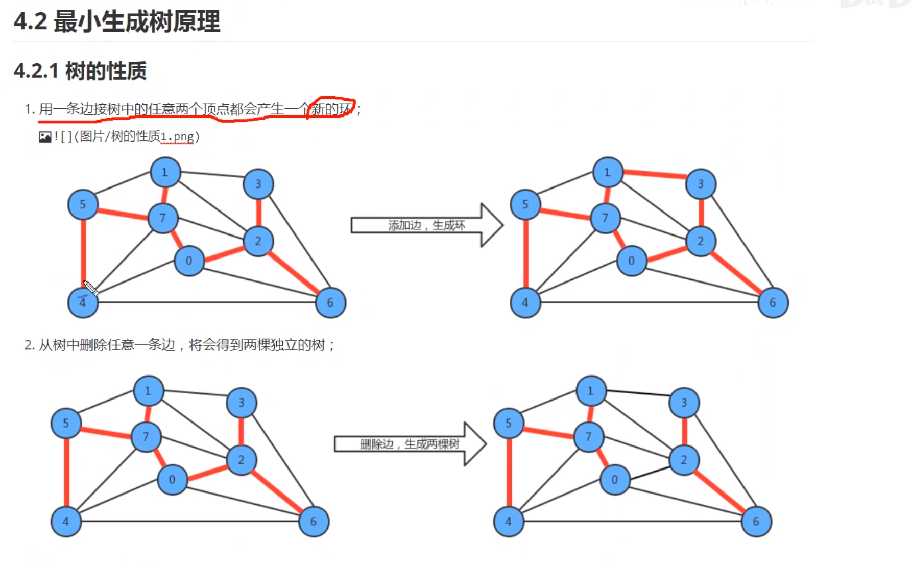

-----------------


图的分类：分为有向图和无向图

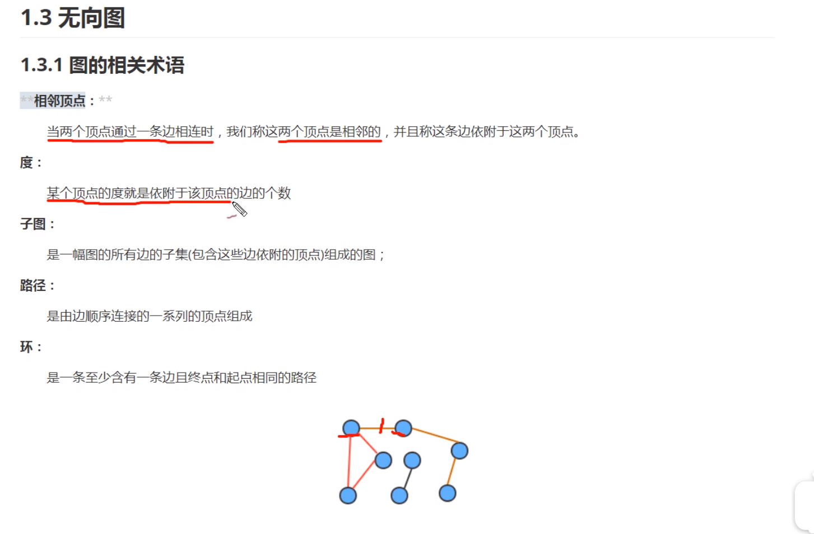

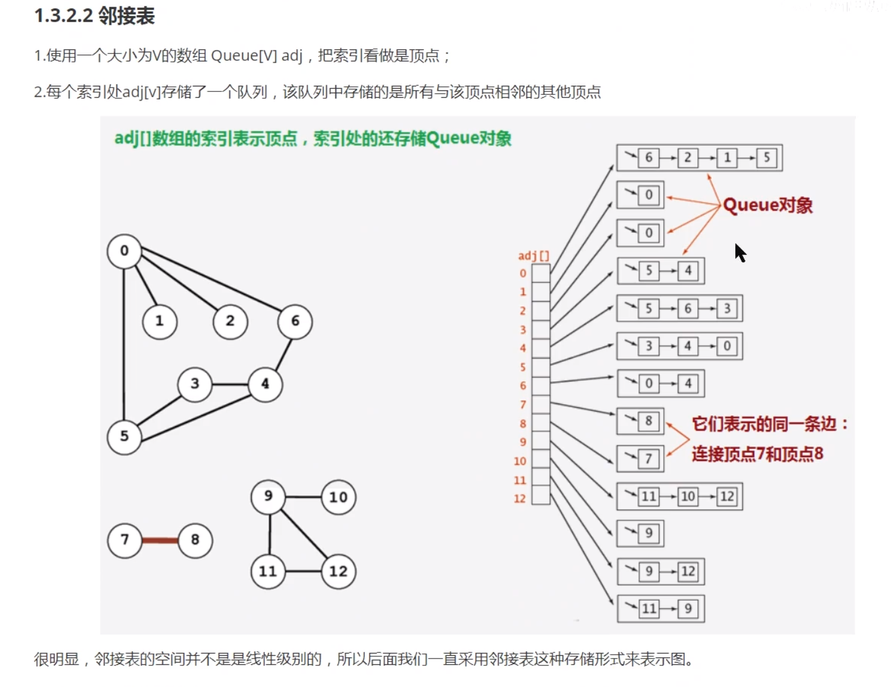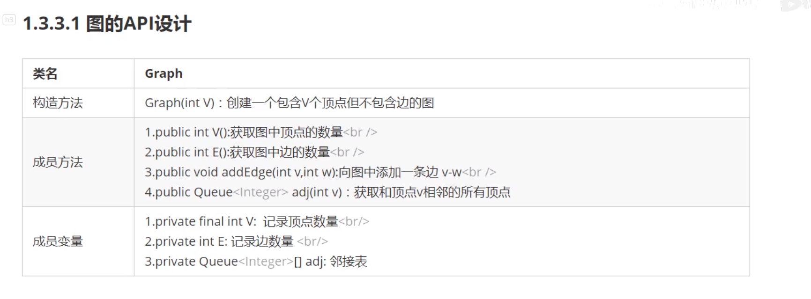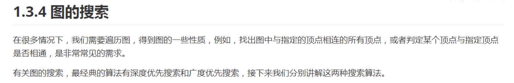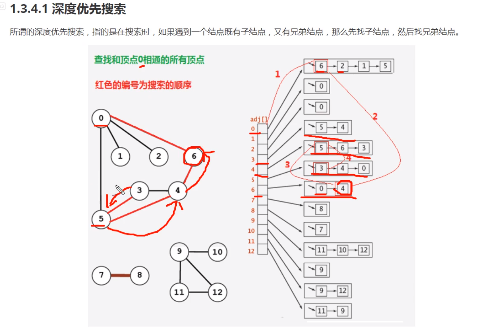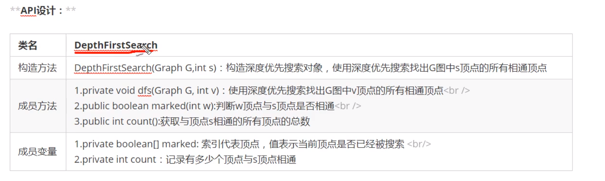

深度遍历的原理：

先从需要搜索的地方开始，循环它的兄弟结点，然后进行深度遍历，如果没有被标记就继续进行深度遍历。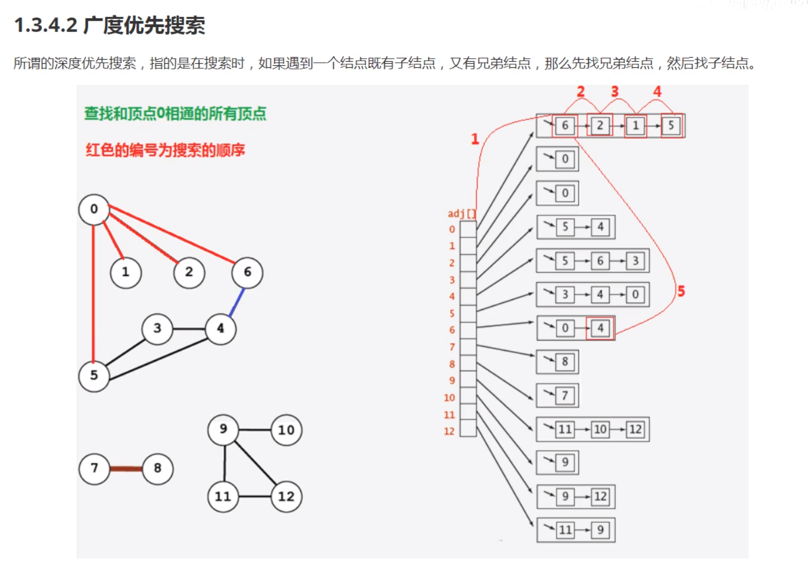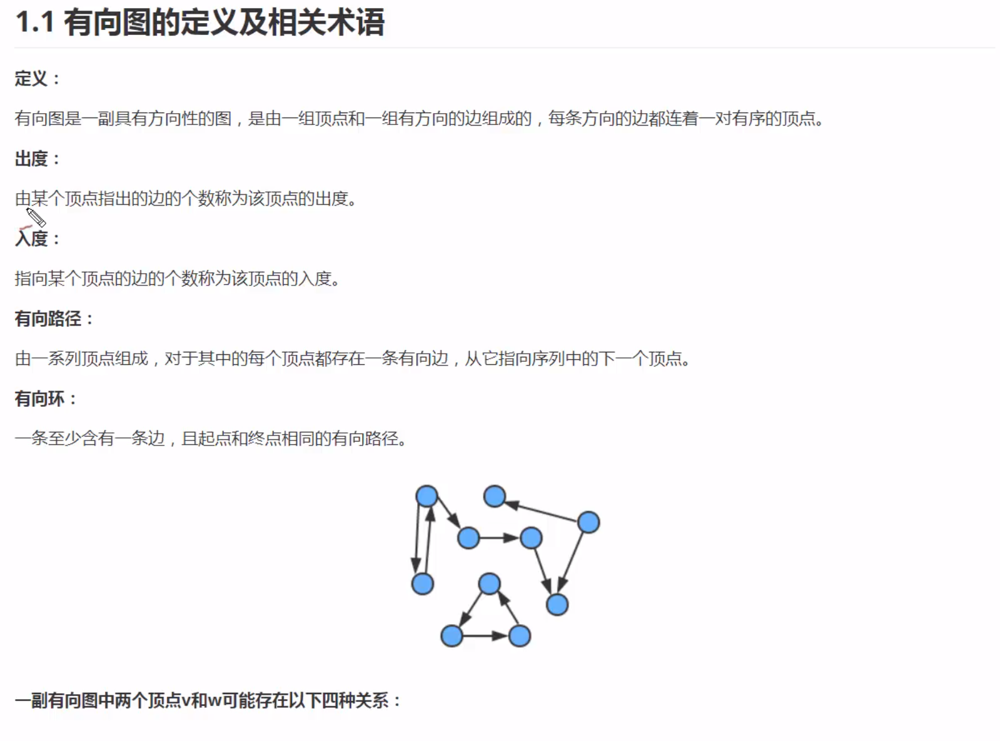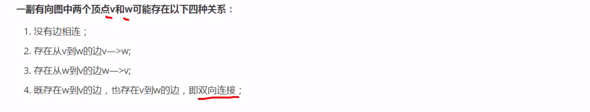