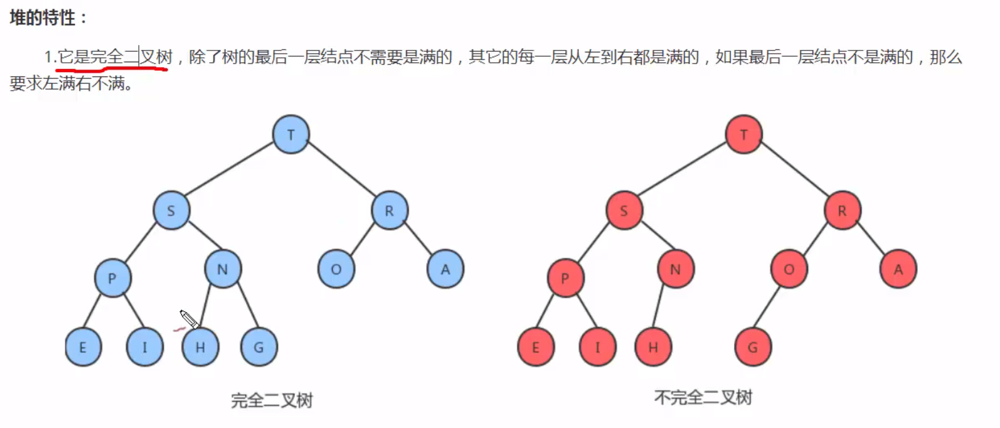
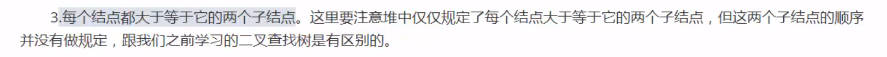
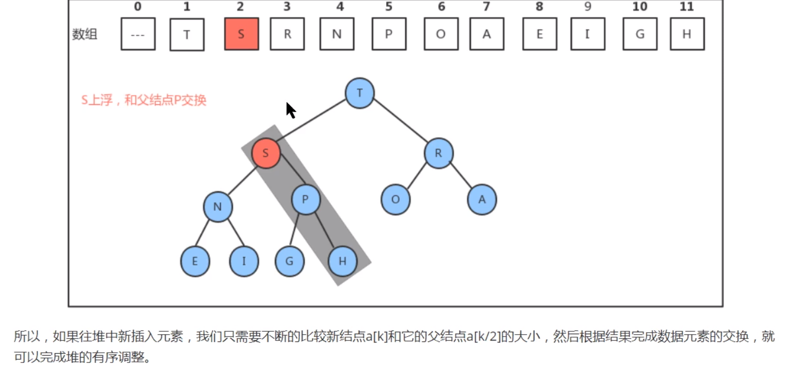
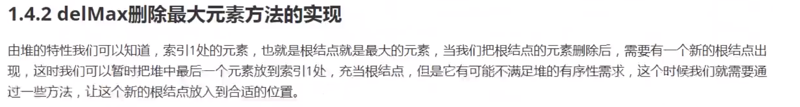

# 堆

堆是一种特殊的数据结构的统称，堆通常被看作是一棵完全二叉树。

## 堆的特性

1.完全二叉树 



2.使用数组来实现


3.左右子节点都小于父结点



## Api设计


swim和sink方法是的结点上浮和下沉，到达一个正确的位置。

## 堆的实现

### insert插入方法实现


现在是插入一个S，S插入在最后一个地方，但是现在不符合堆的特性，S和H进行比较，S>H，所以将它门进行交换，在将S和P进行比叫在进行交换（因为P原来的左右结点都是小于P的，所以子结点都小于P,即使结点上浮也不会有影响。）



上浮方法什么时候结束，一个一个结点进行比较，当条件达到1的时候就没有必要在比较了，如上图，s或者R和2运算结果为1，所以等于1就不需要在进行运算了，所以结束条件是while(h>1).

总结：数据的结点是一直的与父结点进行比较，如果大于父结点就进行交换。

### 删除元素的实现

 


1.如果要删除根节点，会最下方的一个结点与根结点进行交换，然后将最后一个结点进行删除。


2.将根节点的位置进行下沉


3.找出最大的哪一个，与根进行交换。 


4.接着找出G节点的两个子节点，然后找出一个大值，与它进行交换


5.重复上面的步骤。


## 堆排序

堆排序Api设计下“


堆排序，我们将数据复制到堆数组中，然后对堆进行调整。调整的步骤：

- 找出N/2处的结点
- 从N/2一直计算到1这个结点
- 如果大于子结点就交换，如果有子节点，那么就继续进行比较交换


---

记住上浮下沉就可以了，删除的时候从哪里删除

```
package com.algorithm.heap;

/**
 * 使用数组来存储，基本并且需要记录结点的个数
 * 插入数据：
 *  将数据放在最后一个位置，然后将它进行上浮，然后让他和他的父结点进行比较，如果大于父亲结点，那么就将其上浮一个，直到最后一个结点
 *  1.将数据插入到最后一个位置
 *      temp[++N] = t;
 *      swim(N){
 *          while(N>1){
 *              if(temp[N]>temp[N/2]){
 *                  //交换
 *              }
 *              N = N/2;
 *          }
 *      }
 *  2.将结点上浮
 * 删除数据：
 *  删除最大的数据，最大数据在跟的地方，将跟与最下方的进行比较
 *  temp[1] = temp[N-1];
 */
public class Heap<T extends Comparable<T>>{
    //存储堆中的元素
    private T[] temp;
    //记录堆中元素的个数
    private int N;
    public Heap(int capacity){
        this.temp = (T[])new Comparable[capacity];
        this.N = 0;
    }

    //比较大小
    public boolean less(int i,int j){
        return temp[i].compareTo(temp[j])<0;
    }

    //交换数据
    private void exch(int i,int j){
        T t = temp[i];
        temp[i] = temp[j];
        temp[j] = t;
    }

    /**
     *  插入数据,插入数据之后，都会放到最后一个位置上，这个时候
     *  需要结点上浮来完成
     */
    public void insert(T t){
        temp[++N] = t;
        swim(N);
    }

//    堆使用是数组层序存储
//    2n+1  2n
    //上浮
    private void swim(int k){
        while (k>1){
            if (less(k/2,k)){
                exch(k/2,k);
            }
            k = k/2;
        }
    }

    //下沉
    private void sink(int k){
        while (2*k<=N){
            int max;
            //如果有右子节点
            if (2*k+1<=N){
                if (less(2*k,2*k+1)){
                    max = 2*k+1;
                }else {
                    max = 2*k;
                }
            }else {
                max = 2*k;
            }
            if (!less(k,max)){
                break;
            }
            exch(max,k);
            k = max;
        }
    }

    public T delMax(){
        //1.将根结点与最后的哪一个节点进行交换
        T old = temp[1];
        //2.将最后一个结点删除
        exch(1,N);
        //3.下沉操作
        temp[N--] = null;
        sink(1);
        return null;
    }

    public static void main(String[] args) {
        Heap<Integer> heap = new Heap<>(10);
        heap.insert(1);
        heap.insert(2);
        heap.insert(3);
        heap.insert(4);
        heap.insert(5);
        heap.insert(6);
        heap.insert(7);
        heap.delMax();

    }
}
```


堆排序运用了最小堆或者最大堆的用法，将每一个最小或者最大放到了最后


