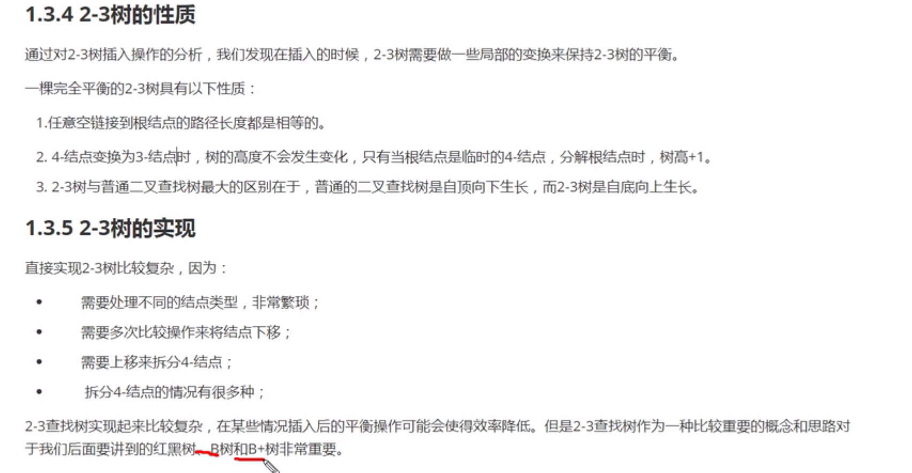
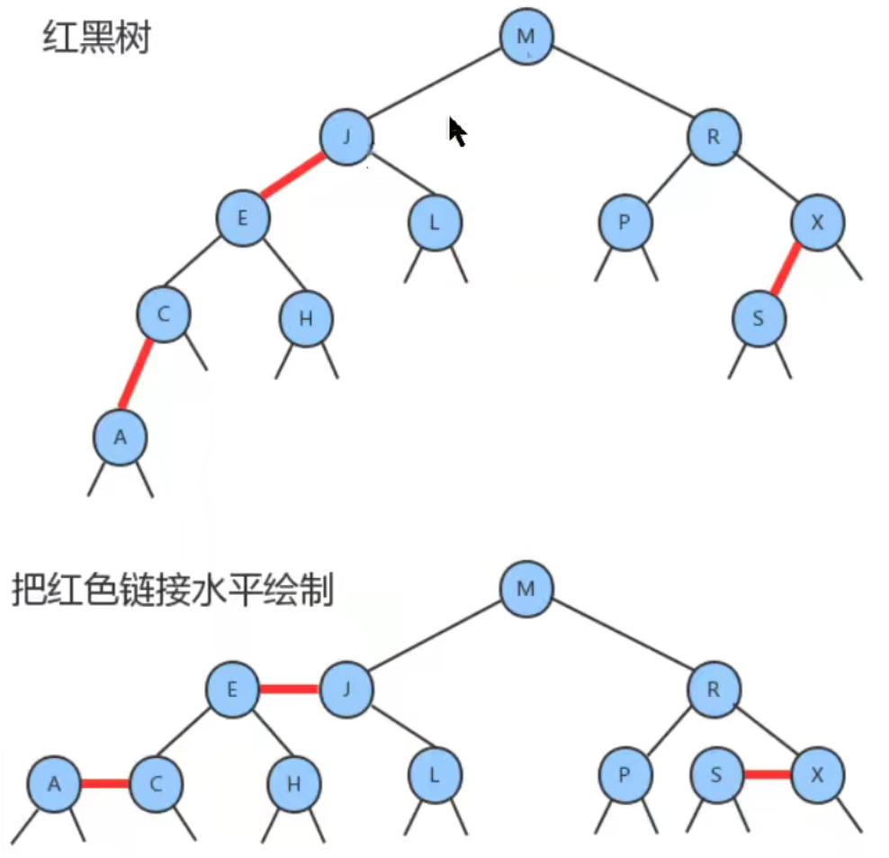
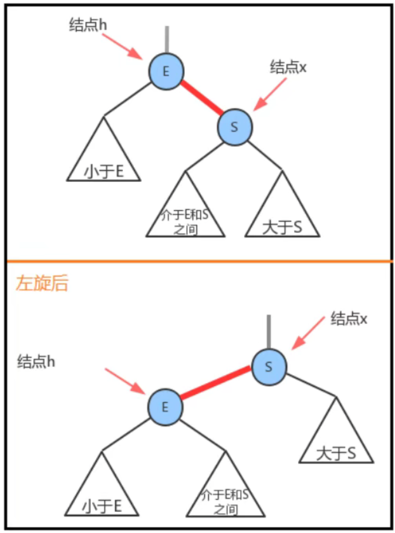
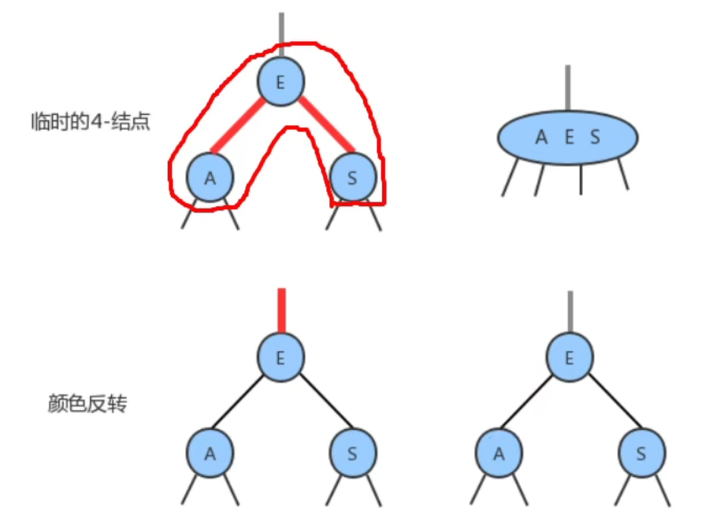

# 树

树是一种重要的数据结构，是由多个有限节点组成的层次关系的集合

## 2-3查找树

二叉树存在不足，那么可以使用2-3查找树，要不是两个节点，要不就是三个节点，两个节点，一个建两个链。
3节点就是3个节点，两个链，三个链

### 查找

##  红黑树

1.红连接为左连接
2.没有一个节点和两个红节点相连
3.2-3树根节点到叶子的长度都相同，那么红黑树黑到根的长度都是相同的

### 红黑树设计

节点key
value
left  
right
color

### 左右旋转

什么时候需要左旋转
1.某个节点左边为黑，右边为红，左旋。

什么时候右旋转
1.左链左链为红

、

根颜色总是黑色的

null默认为黑色
