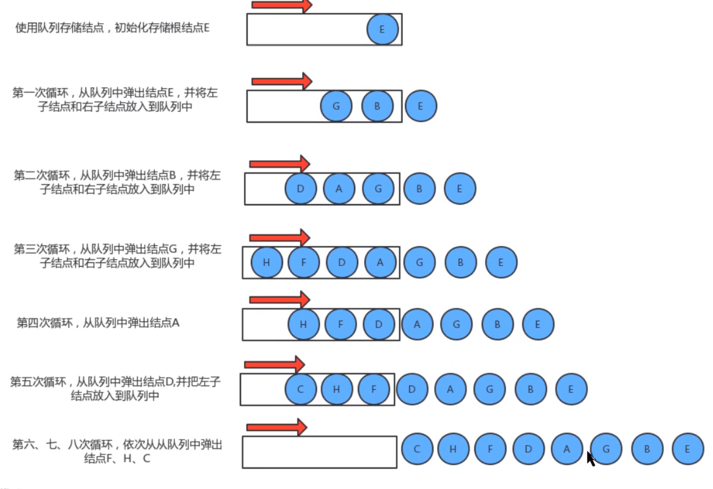
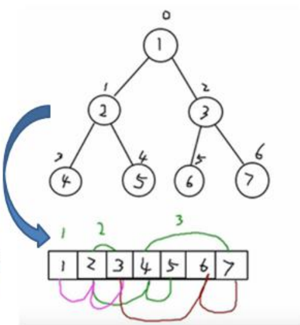

# 二叉树

> 二叉树出现应该和数组存储链式存储的不足引出，为了二者可以兼容起来使用，所以出现了这个。

- 数组存储
  - 可以通过下标读取，速度快
  - 如果检索具体某个值，插入某个值就会移动，效率低下。
- 链式存储结构
  - 插入节点比较快，删除比较快
  - 检索效率低下
- 树存储
  - 可以提高存储，读取效率
  - 保证检索速度

什么是二叉树？

- 有两个节点
- 左子树  右子树
- 所有的子节点在最后一层，总数为2^n-1，满二叉树
- 所有的子叶在最后一层或者倒数第二，最后一层子叶在左边连续，完全二叉树。

## 层序遍历

- 前序遍历
  - 输出
  - 找左
  - 找右
- 中序遍历
  - 找左
  - 输出
  - 找右
- 后续遍历
  - 找左
  - 找右
  - 遍历
- 层序遍历




```java
public class Tree<T> {
    private T t;
    private Tree left;
    private Tree right;

    public Tree(){

    }

    public Tree(T t){
        this.t = t;
    }


    public void qianxu(Tree<T> tree){
        if (tree == null)return;
        System.out.println(tree.t);
        qianxu(tree.left);
        qianxu(tree.right);
    }

    public void zhongxu(Tree<T> tree){
        if (tree == null)return;
        zhongxu(tree.left);
        System.out.println(tree.t);
        zhongxu(tree.right);
    }

    public void houxu(Tree<T> tree){
        if (tree == null)return;
        houxu(tree.left);
        houxu(tree.right);
        System.out.println(tree.t);
    }


    public static void main(String[] args) {
        Tree<Integer> root = new Tree<>(1);
        Tree<Integer> node1 = new Tree<>(2);
        Tree<Integer> node2 = new Tree<>(3);
        Tree<Integer> node3 = new Tree<>(4);
        Tree<Integer> node4 = new Tree<>(5);
        Tree<Integer> node5 = new Tree<>(6);
        root.left = node1;
        root.right = node2;
        root.left.left = node3;
        root.left.right = node4;
        root.right.left = node5;
        System.out.println("-------------------qianxu");
        root.qianxu(root);

        System.out.println("-------------------zhongxu");
        root.zhongxu(root);

        System.out.println("-------------------houxu");
        root.houxu(root);

    }
}

//层序遍历
private Queue<Tree> queue = new ArrayDeque<>();
public void xxx(){

    if (queue.isEmpty())return;
    Tree tree = queue.poll();
    System.out.println(tree.t);
    if (tree.left!=null) {
        queue.add(tree.left);
    }
    if (tree.right!=null) {
        queue.add(tree.right);
    }
    xxx();
}
```


## 查找指定节点

查找也分四种，和上面一样，当数值相同就返回，在遍历方法加一个返回值，然后不写输出方法。

## 删除节点

删除分为两种叶子和非叶子节点。

- 删除叶子节点，删除改节点
- 如果删除非叶子节点，那么就删除改子树

```java
    /**
     * 树删除需要使用父节点删除
     * 如果某个节点的左子树需要删除，那么就设置为null，返回
     * 右子树同理
     * 否则就向左右子树继续走
     */

    private boolean delete(T t){
        if (root.t == t) {
            root = null;
            return true;
        }
        delete(root,t);
        return false;
    }

    private void delete(Tree tree,T t){
        if (tree == null){
            return;
        }
        //删除不了  值传递和引用传递
        if (tree.left!=null&&tree.left.t == t){
            this.left = null;
            return;
        }

        if (tree.right != null && tree.right.t == t){
            this.right = null;
            return;
        }

        if (tree.left != null){
            this.left.delete(this.left,t);
        }

        if (tree.right != null){
            this.right.delete(this.right,t);
        }
    }


}
```


删除节点，左子树接替 父节点，

- 删除非叶子节点

```java
   //-------------------------------------
    private boolean delete1(T t){
        if (root.t == t) {
            if (root.left !=null){
                root = root.left;
            }else if (root.right != null){
                root = root.right;
            }else {
                root = null;
            }
            return true;
        }
        delete1(root,t);
        return false;
    }

    private void delete1(Tree tree,T t){
        if (tree == null){
            return;
        }
        //删除不了  值传递和引用传递
        if (tree.left!=null&&tree.left.t == t){
            this.left = null;
            if (this.left.left!=null){
                this.left = this.left.left;
            }else if (this.left.right!=null){
                this.left = this.left.right;
            }else {
                this.left = null;
            }
            return;
        }

        if (tree.right != null && tree.right.t == t){
            if (this.right.left != null){
                this.right = this.right.left;
            }else if (this.right.right != null){
                this.right = this.right.right;
            }else {
                this.right = null;
            }
            return;
        }

        if (tree.left != null){
            this.left.delete1(this.left,t);
        }

        if (tree.right != null){
            this.right.delete1(this.right,t);
        }
    }
```


## 顺序二叉树

上面使用的是链表的形式存储，然后使用数组存储呢？

数组存储和树存储可以进行相互转换，数组可以转成树，树可以转换为数组。数组存储的实质就是层序遍历。



- 二叉树是完全二叉树
- 第n个左节点：2*n+1
- 第n个元素右：2*n+2
- 第n个父：（n-1）/2

顺序存储（数组）三种遍历方式

```java
    public void preOrder(int index){
        if (arr == null || arr.length == 0){
            System.out.println("-----------");
        }
        System.out.println(arr[index]);
        if ((index * 2 + 1)<arr.length){
            preOrder(2*index + 1);
        }
        if ((index * 2 + 2) < arr.length){
            preOrder(2*index+2);
        }
    }
    public void middleOrder(int index){
        if (arr == null || arr.length == 0){
            System.out.println("-----------");
        }
        if ((index * 2 + 1)<arr.length){
            middleOrder(2*index + 1);
        }
        System.out.println(arr[index]);
        if ((index * 2 + 2) < arr.length){
            middleOrder(2*index+2);
        }
    }

    public void houOrder(int index){
        if (arr == null || arr.length == 0){
            System.out.println("-----------");
        }
        if ((index * 2 + 1)<arr.length){
            houOrder(2*index + 1);
        }
        System.out.println(arr[index]);
        if ((index * 2 + 2) < arr.length){
            houOrder(2*index+2);
        }
    }

}
```

## 线索二叉树


