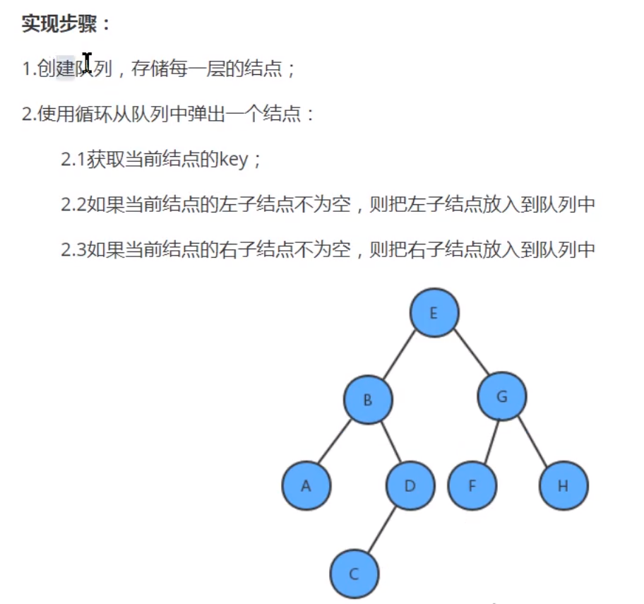

# 二叉树

> 二叉树出现应该和数组存储链式存储的不足引出，为了二者可以兼容起来使用，所以出现了这个。

- 数组存储
  - 可以通过下标读取，速度快
  - 如果检索具体某个值，插入某个值就会移动，效率低下。
- 链式存储结构
  - 插入节点比较快，删除比较快
  - 检索效率低下
- 树存储
  - 可以提高存储，读取效率
  - 保证检索速度

什么是二叉树？

- 有两个节点
- 左子树  右子树
- 所有的子节点在最后一层，总数为2^n-1，满二叉树
- 所有的子叶在最后一层或者倒数第二，最后一层子叶在左边连续，完全二叉树。

## 层序遍历

- 前序遍历
  - 输出
  - 找左
  - 找右
- 中序遍历
  - 找左
  - 输出
  - 找右
- 后续遍历
  - 找左
  - 找右
  - 遍历
- 层序遍历




```java
public class Tree<T> {
    private T t;
    private Tree left;
    private Tree right;

    public Tree(){

    }

    public Tree(T t){
        this.t = t;
    }


    public void qianxu(Tree<T> tree){
        if (tree == null)return;
        System.out.println(tree.t);
        qianxu(tree.left);
        qianxu(tree.right);
    }

    public void zhongxu(Tree<T> tree){
        if (tree == null)return;
        zhongxu(tree.left);
        System.out.println(tree.t);
        zhongxu(tree.right);
    }

    public void houxu(Tree<T> tree){
        if (tree == null)return;
        houxu(tree.left);
        houxu(tree.right);
        System.out.println(tree.t);
    }


    public static void main(String[] args) {
        Tree<Integer> root = new Tree<>(1);
        Tree<Integer> node1 = new Tree<>(2);
        Tree<Integer> node2 = new Tree<>(3);
        Tree<Integer> node3 = new Tree<>(4);
        Tree<Integer> node4 = new Tree<>(5);
        Tree<Integer> node5 = new Tree<>(6);
        root.left = node1;
        root.right = node2;
        root.left.left = node3;
        root.left.right = node4;
        root.right.left = node5;
        System.out.println("-------------------qianxu");
        root.qianxu(root);

        System.out.println("-------------------zhongxu");
        root.zhongxu(root);

        System.out.println("-------------------houxu");
        root.houxu(root);

    }
}


//层序遍历
private Queue<Tree> queue = new ArrayDeque<>();
public void xxx(){

    if (queue.isEmpty())return;
    Tree tree = queue.poll();
    System.out.println(tree.t);
    if (tree.left!=null) {
        queue.add(tree.left);
    }
    if (tree.right!=null) {
        queue.add(tree.right);
    }
    xxx();
}
```


## 查找指定节点

查找也分四种，和上面一样，当数值相同就返回

## 删除节点

删除分为两种叶子和非叶子节点。

- 删除叶子节点

删除节点，左子树接替 父节点，

- 删除非叶子节点

## 顺序二叉树

