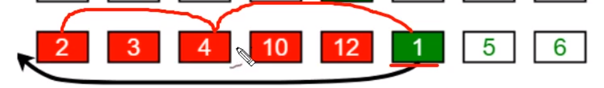

# 排序

排序文件可以装载于内存中，称为内部排序，文件存储于磁盘或者其他设备，成为外部排序。主要区别是：内部排序，可以访问任意项，内部排序必须按照顺序访问。排序需要知道数组排序和链表排序。需要特殊的抽象性，可以使用链表和数组进行实现。

数组排序，通过随机数或者是标准输入进行填充。

## 驱动程序进行数组的排序

**说明：**

main初始化数组，调用排序算法，打印结果。排序的时候需要两个方法，数据比较和数据交换。

```
boolean less(A , B){
    return A > B ;
}

//这个比较，有点问题
void exch(A ，B){
    Item temp = A;
    A = B;
    B = temp;
}

static void swap(int arr[],int x,int y){
    int z = arr[x] ;
    arr[x] = arr[y];
    arr[y] = z;
}
```

> 稳定和不稳定：稳定的就是按照一定的顺序规律，具有重复键的项保持相对顺序。比如一个班的学生，按照字母顺序等。如果稳定排序方法是非常重要的，那么可以加上一个稳定的索引

如果排序的是一个比较大的项，那么我们就没有必要移动整个项，只需要将数据的指针进行移动就可以了。

## 练习

- 小孩的游戏有i张卡片，将其放在i个敦上，将卡片放到敦上，必须一个一个进行试放。

    - 我的答案：5个卡片相当于5个数字，那么就一个一个试着放，合适了就放在上面，下次来的时候，就跳过它。
    
    - 这个我更感觉像是key和value的配对。

- 将牌通过花色排好，在通过大小进行排序。

    - 先通过颜色排序，在通过大小进行排序。


## 选择排序

以小到大排序，先找出最小的，放在第一个位置，在找出次小的放在第二个位置……，它就是每次选择出剩下中最小的数据。每次都需要n-1次，所有时间受次数限制。每次移动对后面的排序提供不了什么帮助。


## 插入排序

## 冒泡排序

冒泡排序将两个相邻的进行交换n次，从小到大进行的排序，将小数据与相邻的进行比较，然后依次进行，最后一个为最大，它们多次执行，直到最后一个。

## 特性

选择排序，插入排序，冒泡排序都是二次性算法，不需要额外的内存，仅仅相差常熟倍。一般地，排序算法的运行时间与比较次数成比例，


# 简单排序

根据某一项进行数据进行排序

基本实现方式：先书写API，然后在进行实现，将算法封装为API。

## Comparable接口介绍

我们一般的排序，是数据，但是更多的是对象，所以就需要知道comparable。

### 设计比较

需要比较的时候，我们需要实现一个Comparable接口，然后在里面指定比较项。这个是里面的和外面的进行比较。

### 案例

```java
public class Student implements Comparable<Student>{
    private String username;
    private int age;

    public Student(String username, int age) {
        this.username = username;
        this.age = age;
    }

    public String getUsername() {
        return username;
    }

    public void setUsername(String username) {
        this.username = username;
    }

    public int getAge() {
        return age;
    }

    public void setAge(int age) {
        this.age = age;
    }

    //为什么需要这个方法，可以将数据打印出来，方便测试
    @Override
    public String toString() {
        return "Student{" +
                "username='" + username + '\'' +
                ", age=" + age +
                '}';
    }
	//调用接口，需要在这里实现一个方法，然后在里面需要定义规则
    @Override
    public int compareTo(Student o) {
        return this.getAge() - o.getAge();
    }
}

```


## 冒泡排序

> 思想：冒泡排序，比较N-1（数据是两两比较的）次然后将数据前一个与后一个比较，将合适的数据放到合适的位置（一次循环根据条件只能选择出一个值）。

### 冒泡API设计

1.构造函数：Bubble()创建对象

2.成员方法：

```java
greater(Comparable v,Comparable w);
sort(Comparable[] a);
exch(Comparable[] a,int i,int j);
```

### 冒泡性能

> 讨论性能一般都是以最快的为准，在冒泡中也以逆序进行讨论。加入6，5，4，3，2，1。这是最坏的情况，他的最终结果是什么呢？？？

```java
//比较次数  等差数列  (n(n-1)))/2
(N-1)+(N-2)+(N-3)+……+1 = N^2/2 - N/2
//交换次数
(N-1)+(N-2)+(N-3)+……+1 = N^2/2 - N/2
```

所以最终的结果是：交换加比较两步完成，那么就是2*(N^2/2-N/2)

```java
N^2/2 - N/2 + N^2/2 - N/2 = N^2 - N
一般的我们只取最高项，所以结果为N^2
```

### 附录：冒泡代码实现

实现步骤：

- 外层循环次数:n.length - 1
- 冒泡索引：j=0,到j-1，之后每次j-1-i;

代码实现

- 伪代码   原理就是找出一个参数，从头比到最后确定一个结果

```java
public void sort(Comparable[] a){
    for(int i=a.length - 1;i >0;i--){
        for(int j=0;j<i;j++){
            if(a[j]>a[j+1]){
                交换
            }
        }
    }
}
```

- 实现

```java
public class Bubble {
    /**
     * 对数组进行排序
     * @param a
     */
    public static void sort(Comparable[] a){
        //冒泡次数（a.length-1）
        for (int i = a.length - 1; i > 0 ; i--) {
            //冒泡最大的索引
            for (int j = 0; j < i; j++) {
                //比较索引和索引j+1
                if (greater(a[j],a[j+1])){
                    exch(a,i,j);
                }
            }
        }
    }

    /**
     * 比较大的数据
     * @param v
     * @param w
     * @return
     */
    public static boolean greater(Comparable v,Comparable w){
        return v.compareTo(w)>0;
    }

    /**
     * 数据元素进行交换
     * @param a
     * @param i
     * @param j
     */
    private static void exch(Comparable[]a,int i,int j){
        Comparable temp ;
        temp = a[i];
        a[i] = a[j];
        a[j] = temp;
    }
}
```

## 选择排序

> 思想：简单说就是最小的值，次小的值，放到开始或者结尾。
>
> 开始假设第一个参数是最小的，然后遍历到最后一个，然后将最小的数据与开始假定的哪个位置进行交换。

### 选择API设计

1.构造函数：Select():创建对象

2.成员方法：

```java
greater(Comparable v,Comparable w);
sort(Comparable[] a);
exch(Comparable[] a,int i,int j);
```

### 选择排序性能分析

> 讨论性能一般都是以最快的为准，在冒泡中也以逆序进行讨论。加入6，5，4，3，2，1。这是最坏的情况，他的最终结果是什么呢？？？

```java
//比较次数
(N-1)+(N-2)+(N-3)+……+1 = N^2/2 - N/2
//交换次数
N-1
```

所以最终的结果是：

```java
N^2/2 - N/2 + N - 1 = N^2 - N/2 + N - 1 = N^2
一般的我们只取最高项，所以结果为N^2
```

### 附录：选择代码实现

实现步骤：

- 外层循环需要的次数：a.length - 1
- 内层循环：从i+1开始，找出只就到第a.length个，依次向后

实现

- 伪代码

```java
public void sort(compable[]a){
    int min = Integer.MIN_VALUE;
    for(int i = 0 ; i < a.length-1;i++){
        min = i
        for(int j = 1+i;j<a.length;j++){
            if(a[min]>a[j]){
                min = j;
            }
        }
        exch();
    }
}
```


- 代码实现

```java
public class SelectSort extends SortAbstr {
    public static void sort(Comparable[] a){
        int min = 0;
        //最后一个数据了，就不需要在比较了，所以是length-1
        for (int i = 0; i < a.length-1; i++) {
            min = i;
            //第一次从1开始，下来是2……
            for (int j = 1+i; j < a.length; j++) {
                if (greater(a[min],a[j])){
                    min = j;
                }
            }
            //如果数据没有变化，就不要浪费资源了
            if (min !=i){
                exch(a,i,min);
            }
        }
    }
}
```

补充一点：
这个的交换是可以实现的，参数是数组，直接操作的是数组地址的内容。

java是不可以方法临时变量直接进行交换的，c语言是因为可以使用指针。

## 插入排序


> 实现思想：
>
> 将数组分为未排序部分和已排序部分，先从为排序部分拿出数据，和已经排序的部分进行比较。


### 插入排序API设计

1.构造函数：
2.成员方法：

```java
greater(Comparable v,Comparable w);
sort(Comparable[] a);
exch(Comparable[] a,int i,int j);
```

### 性能

> 讨论性能

```java
//比较次数
(N-1)+(N-2)+(N-3)+……+1 = N^2/2 - N/2
//交换次数
(N-1)+(N-2)+(N-3)+……+1 = N^2/2 - N/2
//一共的比较次数为
N^2 - N
```

所以最终的结果是：

```java
性能的计算结果
一般的我们只取最高项，所以结果为N^2
```

### 附录：选择排序代码实现

实现步骤：

- 最外层从1开始
- 内层循环从最大的地方向最小进行遍历

实现：

- 伪代码

```java
public void sort(Comparable[]a){
    for(int i=1;i<a.length;i++){
        for(int j = i;j>0;j--){
            if(a[j]>a[j-1]){
                交换
            }else{
                break;
            }
        }
    }
}
```


- 实现

```java
public class InsertSort extends SortAbstr {
    public void sort(Comparable[] a){
        //确定数据的开始和结尾开始数据是1，结尾为数组的最后一个元素
        for (int i = 1; i < a.length; i++) {
            //内循环，从最大的位置向最小的位置进行遍历
            for (int j = i; j >0 ; j--) {
                if (greater(a[j],a[j-1])){
                    exch(a,j,j-1);
                }else {
                    break;
                }
            }
        }
    }
}
```

## 总结

根据以上方式进行的创建，在时间复杂度都为N^2.如果数据非常大就不再实用。


## 附：comparable和comparator区别

最明显的区别就是，一个是内部排序，一个是外部排序。

ag:

- comparable

```java
package com.algorithmre.bean;

public class Student implements Comparable<Student> {
    private String name;
    private int age;

    public String getName() {
        return name;
    }

    public void setName(String name) {
        this.name = name;
    }

    public int getAge() {
        return age;
    }

    public void setAge(int age) {
        this.age = age;
    }

    public Student(String name, int age) {
        this.name = name;
        this.age = age;
    }

    @Override
    public int compareTo(Student o) {
        return age - o.getAge();
    }
}

```


- comparator

```java
package com.algorithmre.bean;

import java.util.Comparator;

public class Person implements Comparator<Person> {
    private String name;
    private int age;

    public String getName() {
        return name;
    }

    public void setName(String name) {
        this.name = name;
    }

    public int getAge() {
        return age;
    }

    public void setAge(int age) {
        this.age = age;
    }

    public Person(String name, int age) {
        this.name = name;
        this.age = age;
    }

    @Override
    public int compare(Person o1, Person o2) {
        return o1.age - o2.age;
    }

    @Override
    public boolean equals(Object obj) {
        return false;
    }
}

```

测试

```java
public class ComparableTest{
    public static void main(String[] args) {
        Student stu1 = new Student("kw",1);
        Student stu2 = new Student("kw",2);
        System.out.println("输出："+stu1.compareTo(stu2));
        Person person = new Person("kw",4);
        Person person1 = new Person("kw",5);
        System.out.println(person.compare(person,person1));
    }
}
```

## 堆排序


冒泡 选择  插入  归并  快排  shell 基数排序  堆排序 


# 复杂排序

高级排序为了减少简单排序的问题，所以现在学习高级排序。

## shell排序

它是插入排序的扩展，插入排序每次只会移动一位，shell排序，可以将其一次移动多位。



希尔排序，每次不是与前一个比较，而是与前几个比较。

原理：将数据进行分组，对分组之后的数据进行排序。

选定一个增长量h，按照增长量h作为数据分组的依据，对数据进行分组。

减少增长量，最小减为1，重复即可 。


```java
int h=1;
while(h<数组的长度/2){
    h=2h+1;
}

减小规则 h=h/2;
```

### 性能分析

shell排序事前分析比较麻烦，并且涉及许多数学知识，所以通过事后分析的方式进行分析。

### 代码实现

实现步骤：

- 确定h
- h怎么变
- 和插入排序的区别就是跳的步数不一样。

实现

- 伪代码

```java
//确定h
h=1;
while(a.length/2>h){
    h = 2*h+1;
}

while(h>=1){
    for(int i=h;i<comparable.length;i++){
        for(int j=i;j>0;j-=h){
            if(){
                交换
            }else{
                break;
            }
        }
    }
    h = h/2;
}
```


- 实现

```java
public class ShellSort extends SortAbstr {
    public static void sort(Comparable[] comparable){
        //求出h
        int h = 1;
        while (h<comparable.length/2){
            h = h*2+1;
        }

        while (h >= 1) {
            for (int i = h; i < comparable.length; i++) {
                for (int j = i; j > 0; j -= h) {
                    if (greater(comparable[j], comparable[j - h])) {
                        exch(comparable, j, j - h);
                    } else {
                        break;
                    }
                }
            }
            h /=2;
        }
    }

    public static void main(String[] args) {
//        Integer integer[] = {2,4,2,5,3,7,8};
//        sort(integer);
//        System.out.printf("integer arr"+ Arrays.toString(integer));
        int n = 100000;
        Integer[] arr = new Integer[n];
        for (int i = 0; i < n; i++) {
            arr[i] = n-i;
        }
        Long start = System.currentTimeMillis();
        sort(arr);
        System.out.println("end"+(System.currentTimeMillis() - start));
    }
}

```

## 归并排序

### 递归

在方法内部调用方法本身就叫递归。递归的层级不需要太深，如果太深就会出现栈溢出

### 思想

归并排序就是对数据先进行分组，分的组在合成一个组，创建一个数组作为辅助数组，


## 附录:代码实现

实现步骤

- 将数组分为左边和右边，一直分到数据的左右大于等于右边即可
- 将数据进行合并，创建三个变量，一个临时数组
  - 将数据放到临时数组中，按照从小到大的顺序
  - 将临时数组中的数据复制到原来的数组中

代码实现

- 伪代码

```java
public void sort(Comparable[]a,int start,int end){
	if（start>=end）{
        return;
    }
    int mid = (start+end) / 2;
    sort(a,start,mid);
    sort(a,mid+1,end);
    marge(a,start,mid,end);
}
//假设他是已经初始化的
private int[]arrTemp ;
public void marge(Compare[]a,int start,int mid,int end){
   int p1 = start;
   int p2 = mid+1;
   int arrTempIndex = start;
   while(p1<=mid&&p2<=end){
       if(a[p1]<a[p2]){
           arrTemp[arrTempIndex++] = a[p1++];
       }else{
           arrTemp[arrTempIndex++] = a[p2++];
       }
   }
   while(p1<=mid){
        arrTemp[arrTempIndex++] = a[p1++];
   }
   while(p2<=end){
        arrTemp[arrTempIndex++] = a[p2++];
   }
    for(int i=start;i<end){
        a[i] = a[arrTempIndex];
    }
}
```


- 代码实现

## 快速排序

快速排序先将数据进行分割，然后在进行排序，分割的方式是将大数据放到所选出的数据后面，小的放到前面，然后再次进行分割。当lo>=hi结束。

```java
    public static void sort(Comparable[] a){
        int lo = 0;
        int hi = a.length - 1;
        sort(a,lo,hi);
    }
    public static void sort(Comparable a[],int start,int end){
        int lo = start;
        if (end<=lo){
            return;
        }
        //分组
        int position = partition(a,start,end);
        //左边有序
        sort(a,start,position-1);
        //右边有序
        sort(a,position+1,end);
    }

    public static int partition(Comparable[] a, int start, int end){
        int left = start;
        int right = end+1;
        Comparable key = a[start];
        while(true){
            while((key.compareTo(a[++left]))>0){
                if (left>=end){
                    break;
                }
            }
            while((key.compareTo(a[--right]))>0){
                if (right<=start){
                    break;
                }
            }
            if (left>=right){
                break;
            }else {
                exch(a,left,right);
            }
        }
        //将定义标准的值进行交换
        exch(a,start,left);
        return left;
    }
```


## 稳定性

加入A元素和B元素是相等的，那么A元素和B元素交换了位置，就是不稳定的，如果没有交换位置就是稳定的。


如果只需要一次排序，那么就不需要考虑稳定性，如果是多次排序就需要考虑这个问题。

