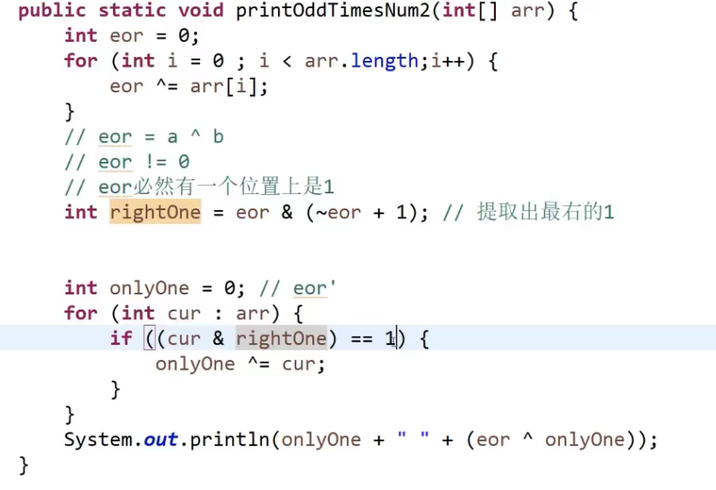

## 异或怎么理解

无进位的相加

0和任何数字进行异或都是任何数字

任何数字 异或  任何数字

交换律：a^b^c  a^c^b

so一大堆的数，进行异或的顺序无关

```jav
a,b
a = a ^ b;
b = a ^ b;
a = a ^ b;
```

位置不可以相同   位置相同的时候就会将数据抹掉。


一个数奇数次。，将所有的都进行一次异或操作

偶数次，先进行一次异或，得到不同值a^b，得到它们不相同的

在进行一次异或，数据分为两部分，a or b


a & (~a + 1)提取最右侧的1




